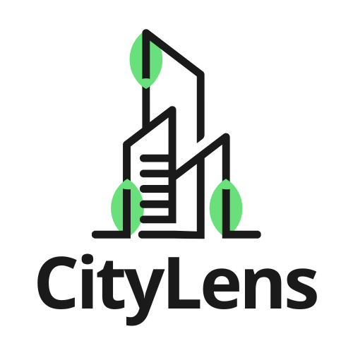

<p align="center">
  
</p>

<h1 align="center">CityLens Backend</h1>

<p align="center">
  <strong>REST API và NGSI-LD cho Smart City Platform</strong>
</p>

<p align="center">
  <a href="https://www.gnu.org/licenses/gpl-3.0">
    
  </a>
  
  
</p>

---

## Video Hướng dẫn

<div align="center">

[](https://www.youtube.com/watch?v=n725hlexIL8)

**[▶Xem video hướng dẫn chạy Backend](https://www.youtube.com/watch?v=n725hlexIL8)**

</div>

---

## Quick Start với Docker

Cách nhanh nhất để chạy CityLens Backend:

```bash
# Clone repository
git clone https://github.com/PKA-Open-Dynamics/CityLens.git
cd CityLens/backend

# Chạy 1 lệnh duy nhất
./start.sh
```

Script sẽ tự động:
- ✅ Tạo file .env từ template
- ✅ Build Docker image
- ✅ Khởi động PostgreSQL và Redis
- ✅ Khởi động Backend API

Truy cập API sau khi khởi động:
- **API Documentation**: http://localhost:8000/docs
- **API Endpoint**: http://localhost:8000/api/v1
- **Health Check**: http://localhost:8000/health

### Import database (487,000+ OSM entities)

Sau khi backend chạy, xem hướng dẫn import dữ liệu:

```bash
# Xem hướng dẫn chi tiết
cat DATABASE_IMPORT.md

# Hoặc import trực tiếp (nếu có file dump)
docker exec -i citylens-postgres psql -U citylens -d citylens_db < citylens_dump.sql
```

### Dừng services

```bash
docker-compose down        # Dừng nhưng giữ data
docker-compose down -v     # Dừng và xóa tất cả data
```

---

## Tong quan

CityLens Backend cung cấp REST API và NGSI-LD API cho:
- Quản lý báo cáo từ người dân (citizen reports)
- Dữ liệu địa lý từ OpenStreetMap (boundaries, streets, POIs)
- Tích hợp dữ liệu thời gian thực (weather, AQI, traffic)
- API chuẩn NGSI-LD theo ETSI specification

## Công nghệ

| Thành phần | Công nghệ | Phiên bản |
|------------|-----------|-----------|
| Framework | FastAPI | 0.109.0 |
| Database | PostgreSQL + PostGIS | 15+ |
| ORM | SQLAlchemy + GeoAlchemy2 | 2.0.25 |
| Cache | Redis | 7+ |
| Document Store | MongoDB | 7+ (tùy chọn) |
| API Standards | REST, NGSI-LD | v1 |

## Cài đặt từ mã nguồn (Development)

### Yêu cầu hệ thống

- Python 3.11 trở lên
- PostgreSQL 15+ với extension PostGIS
- Redis 7+ (tùy chọn, cho caching)
- MongoDB 7+ (tùy chọn, cho real-time events)

### Cài đặt tự động

```bash
chmod +x setup.sh
./setup.sh
```

### Cài đặt thủ công

**Bước 1: Clone repository**

```bash
git clone https://github.com/PKA-Open-Dynamics/CityLens.git
cd CityLens/backend
```

**Bước 2: Tạo virtual environment**

```bash
# Linux/macOS
python -m venv venv
source venv/bin/activate

# Windows
python -m venv venv
venv\Scripts\activate
```

**Bước 3: Cài đặt dependencies**

```bash
pip install -r requirements.txt
```

**Bước 4: Cấu hình environment**

```bash
cp .env.example .env
# Chỉnh sửa .env với thông tin database của bạn
```

**Bước 5: Khởi tạo database**

```bash
# Tạo database PostgreSQL với PostGIS
createdb citylens
psql -d citylens -c "CREATE EXTENSION postgis;"

# Chạy migrations
alembic upgrade head

# Seed dữ liệu mẫu (tùy chọn)
python scripts/init_db.py
```

**Bước 6: Chạy server**

```bash
# Development mode
uvicorn app.main:app --reload --host 0.0.0.0 --port 8000

# Production mode
uvicorn app.main:app --host 0.0.0.0 --port 8000 --workers 4
```

## API Documentation

Sau khi chạy server, truy cập:

| Tài liệu | URL |
|----------|-----|
| Swagger UI | http://localhost:8000/docs |
| ReDoc | http://localhost:8000/redoc |
| OpenAPI JSON | http://localhost:8000/openapi.json |

### API Endpoints

| Prefix | Mô tả |
|--------|-------|
| `/api/v1/auth/` | Xác thực (login, register) |
| `/api/v1/users/` | Quản lý người dùng |
| `/api/v1/reports/` | Báo cáo công dân CRUD |
| `/api/v1/geographic/` | Dữ liệu địa lý (boundaries, streets) |
| `/api/v1/statistics/` | Analytics và thống kê |
| `/ngsi-ld/v1/entities` | NGSI-LD entities |

## Cấu trúc thư mục

```
backend/
├── app/
│   ├── api/v1/          # API routes
│   │   └── endpoints/   # Endpoint handlers
│   ├── adapters/        # External API adapters
│   ├── core/            # Config và security
│   ├── db/              # Database connections
│   ├── models/          # SQLAlchemy models
│   ├── schemas/         # Pydantic schemas
│   └── services/        # Business logic
├── alembic/             # Database migrations
├── graphdb/             # LOD ontology
├── scripts/             # Utility scripts
├── setup.sh             # Script cài đặt
├── CHANGELOG.md         # Lịch sử thay đổi
├── CONTRIBUTING.md      # Hướng dẫn đóng góp
├── DEPENDENCIES.md      # Thông tin thư viện
├── LICENSE              # GPL-3.0 License
└── requirements.txt     # Python dependencies
```

## Testing

```bash
# Chạy tests
pytest

# Với coverage
pytest --cov=app --cov-report=html
```

## Đóng góp

Xem [CONTRIBUTING.md](CONTRIBUTING.md) để biết cách đóng góp cho dự án.

## Giấy phép

Dự án này được phát hành theo giấy phép **GNU General Public License v3.0 (GPL-3.0)**.

```
Copyright (c) 2025 CityLens Contributors

This program is free software: you can redistribute it and/or modify
it under the terms of the GNU General Public License as published by
the Free Software Foundation, either version 3 of the License, or
(at your option) any later version.
```

Xem file [LICENSE](LICENSE) để biết chi tiết.

## Tài liệu liên quan

- [DEPENDENCIES.md](DEPENDENCIES.md) - Danh sách thư viện
- [CHANGELOG.md](CHANGELOG.md) - Lịch sử thay đổi
- [Main README](../README.md) - Tài liệu dự án chính
